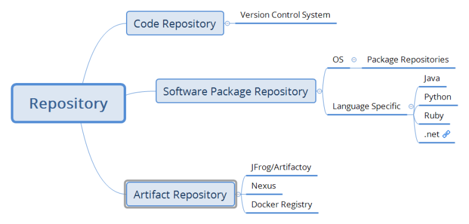

### Terms to understand

* Repository: Repository is a storage location. Often table of contents is also stored along with metadata.
* Version Control System: Version control, also known as source control is the practice of tracking and managing changes to software code

### Quick look at CI/CD
* Overview


*  Requirements for code-collobaration


### Version Control System

* These are the software tools that help software teams to manage changes to source code over time.
* Version Controls Systems (VCS) keeps track of modification the code in special kind of database, If a mistake is made, developers can turn back the clock, compare earlier changes and fix the code or move back to earlier version
* Types of Version Control System
    * Centralized Version Control System
    * Distributed Version Control System

## Centralized Version Control System

* Overview:


* Examples:
   * Subversion (SVN)
   * Perforce
   * IBM ClearCase

## Distributed Version Control System

* Overview:


* Examples:
    * Git
    * Mercurial
    * Bazaar
* Git is the most popular Version Control System. 
* Git was created by Linus Torvalds (Who create Linux Kernel)
* The primary objective behind Git was to implement & design a version control system that was distributed, reliable and fast.
* This version control system was created to manage Linux Code base.
* Torvalds had three criteria 
    * distributed
    * effecient
    * safe from corruption
* There was no open source distributed version control systems in mid 2000’s , Hence he developed Git out of necessity

## Repository Types

* Types



## Version Control Systems

* Need for servers in Distributed Version Control System


* These servers which host Distributed Version Control System
    * Can be installed on the servers in your organization. (Self Hosted)
    * Can be using Version Control System as Service (Which is managed by cloud or third party)
*  Google the following:
    * What is GitHub
    * What is BitBucket
    * What is Gitolite
    * What is GitLab
    * What is Azure Source Repos
    * What is AWS Code Commit


* Public vs Private Git Repositories 
* Self Hosted and Cloud Hosted


## Activities

* Azure:

    * Azure Account (Free tier) creation

* AWS:

    * AWS Account free tier creation

## Installation of GIT

* Softwares for the Mac users:
    * Install Homebrew [Refer Here](https://brew.sh/)
        ```
        /bin/bash -c "$(curl -fsSL https://raw.githubusercontent.com/Homebrew/install/HEAD/install.sh)"
        ```
    * Install visual studio code: 
        ```
        brew install --cask visual-studio-code
        ```
    * Install git
        ```
         brew install git
        ```
 * Softwares for the Linux users:
     * Install using apt module
        ```
        sudo apt update
        sudo apt install git -y
        ```
* Softwares for the Windows users: [Refer Here](https://git-scm.com/downloads)


