## Learning Git

* Approach
   * We will Start Git by Working on one-system
        * Git features
        * How it tracks
        * How Git Works
        * etc…
   * We will be using git completely from command line.
   * Then we will add Distributed VCS (GitHub/Azure Source Repos/Code Commit)
   * How organizations use Git for their product lines

## Getting Started with Git
* Working with local repository: 
    * Create an intitial repository 
        * We would require empty folder/directory
        * Then initialize with git command
            ``` git init (collect screenshot with .git) ```
        * Make changes and query status

            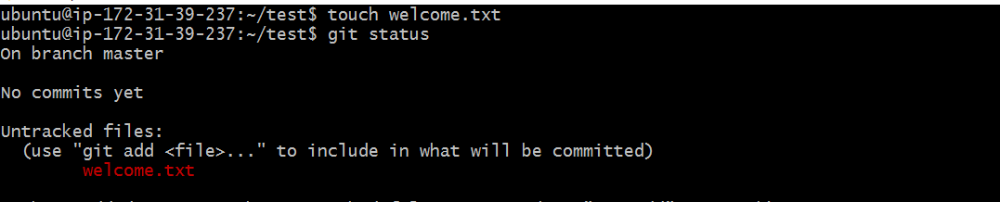

        * Add changes to index/staging area

            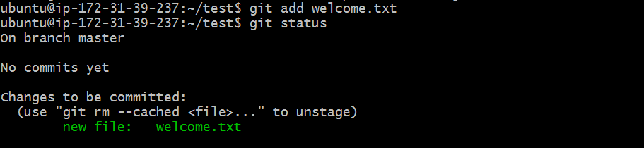

        * Once we commit the changes the history will be maintained, To maintain history git requires

          * commiter emailid
          * commiter name
          * commit message
          * date time
        * Let configure the commiter email id and username (Once at a system level)
             ```
             git config --global user.name "FIRST_NAME LAST_NAME"
             git config --global user.email "MY_NAME@example.com"
             ```
        * commit messsage is provided during commit and date time will be picked by git automatically

            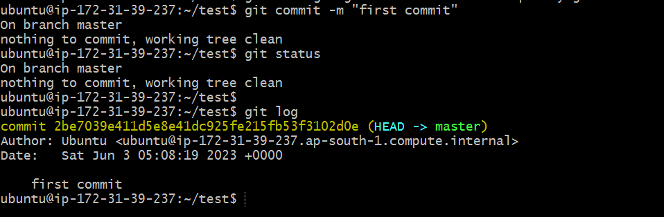

        * Few Areas of git relavent to local repo

           

        * Lets modify the file and create a second commit
           
           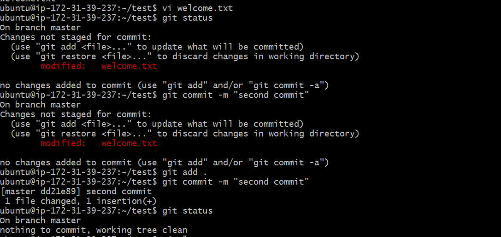

           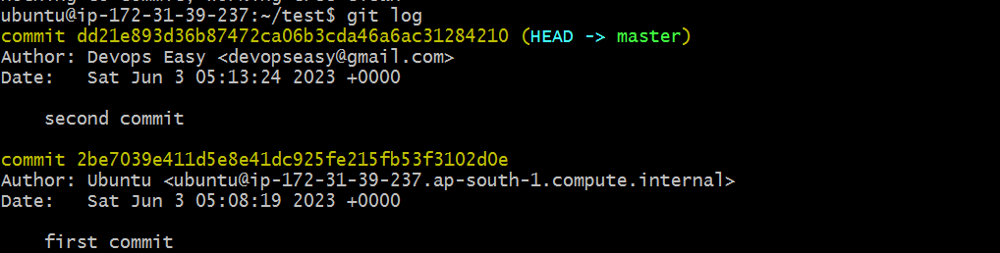

        * For using git commands refer cheatsheet of your choice

* In Git We add changes to the Staging area from Working directory
* New files are referred as untracked files as they were never part of the version control system (local repo)

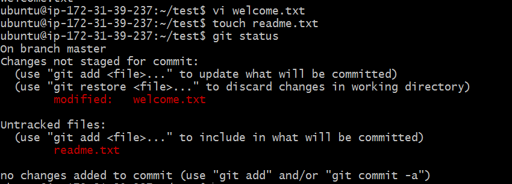

* Now add the changes to the staging area

```
git add .
git status
```
* Now commit the changes with some message

```
git commit -m "Added changes to third commit"
git status
git log
```
* Now lets delete a file

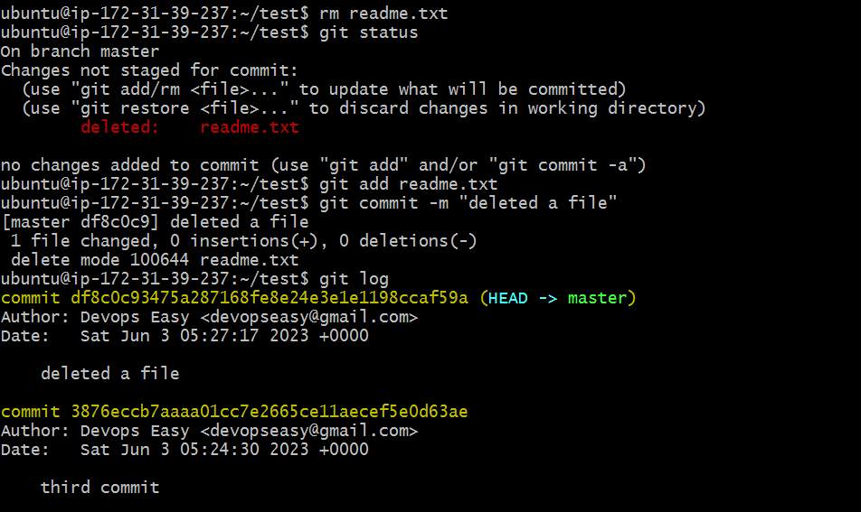

* Git will not track empty directories. When you add files to the directory then git will consider the files added

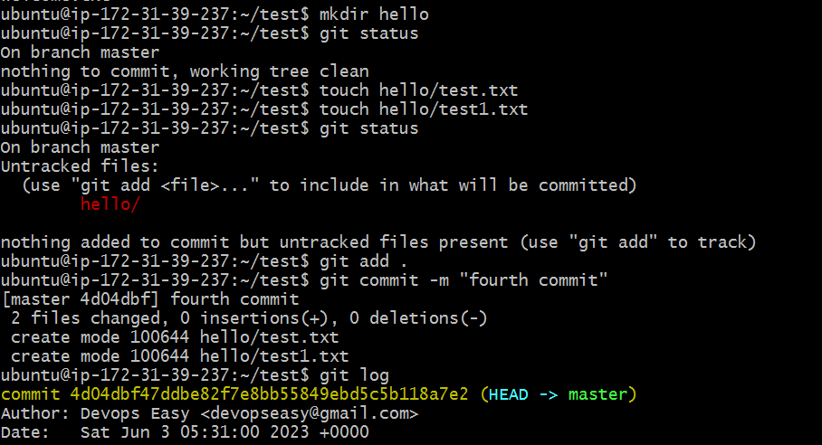

* Some useful commands so far

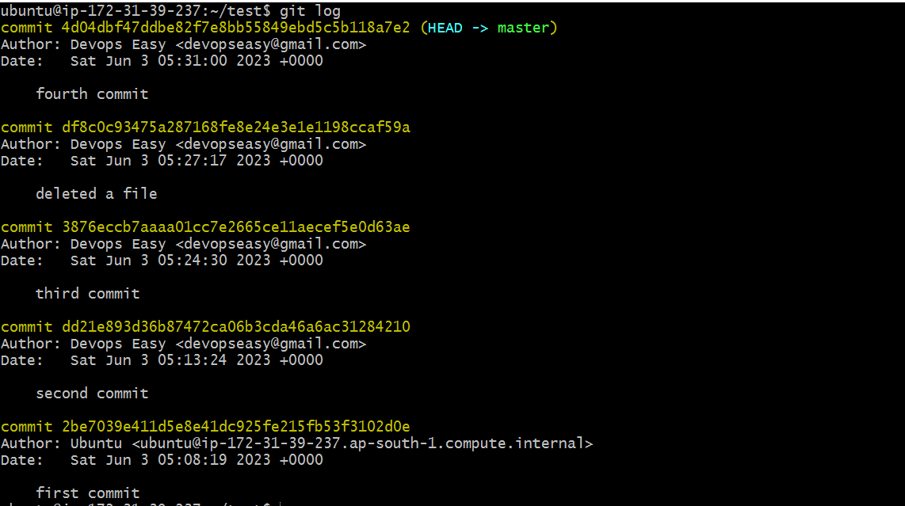

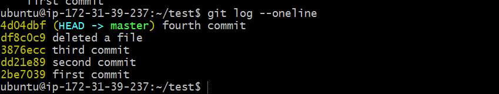

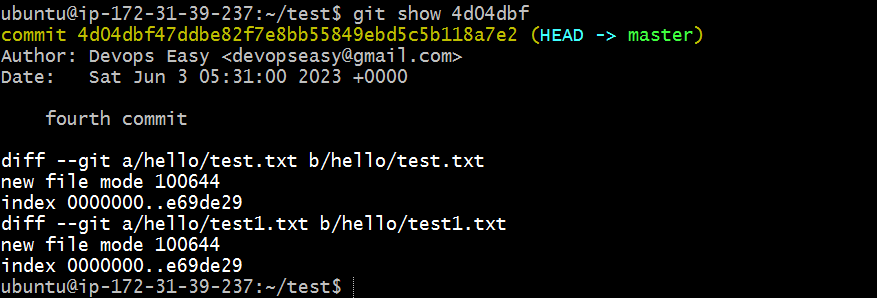

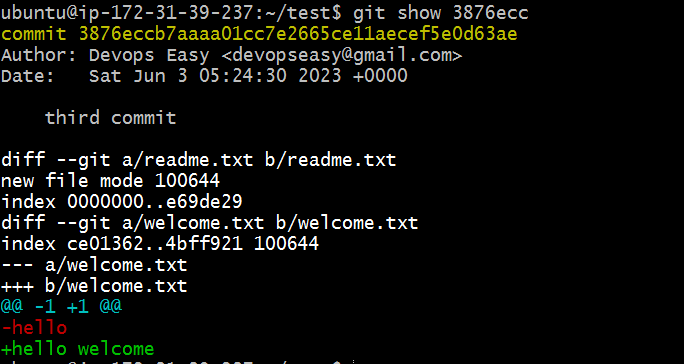

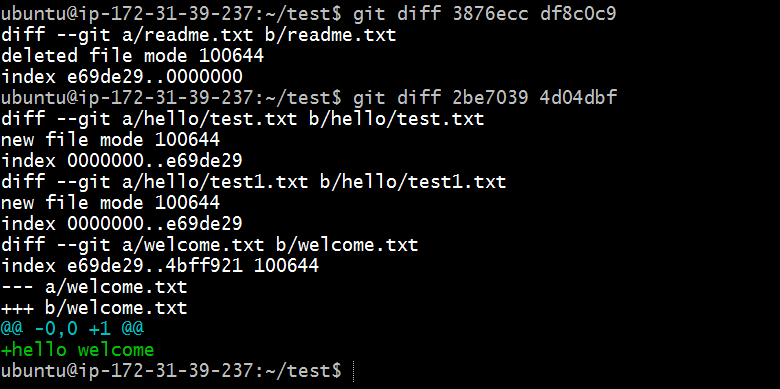

* Adding multiple changes to staging area and then commiting them

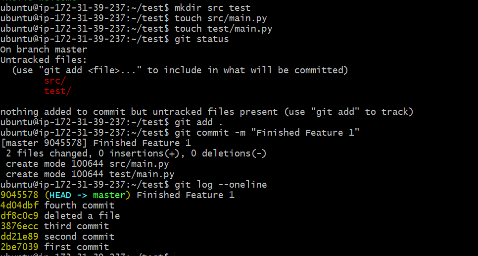
