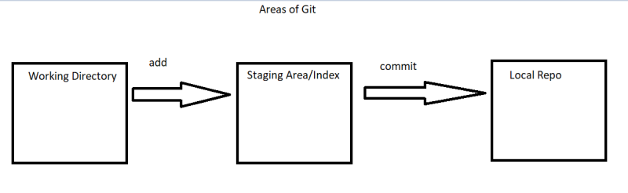

## Learning Git

* Approach
   * We will Start Git by Working on one-system
        * Git features
        * How it tracks
        * How Git Works
        * etc…
   * We will be using git completely from command line.
   * Then we will add Distributed VCS (GitHub/Azure Source Repos/Code Commit)
   * How organizations use Git for their product lines

## Getting Started with Git
* Working with local repository: 
    * Create an intitial repository 
        * We would require empty folder/directory
        * Then initialize with git command
            ``` git init (collect screenshot with .git) ```
        * Make changes and query status
            ```
            touch welcome .txt
            git status (collect screenshot)
            ```
        * Add changes to index/staging area
            ```
            git add welcome.txt 
            git status (screenshot)
            ```
        * Once we commit the changes the history will be maintained, To maintain history git requires

          * commiter emailid
          * commiter name
          * commit message
          * date time
        * Let configure the commiter email id and username (Once at a system level)
             ```
             git config --global user.name "FIRST_NAME LAST_NAME"
             git config --global user.email "MY_NAME@example.com"
             ```
        * commit messsage is provided during commit and date time will be picked by git automatically
            ```
            git commit -m "this is my first commit(take screenshot)"
            git log (take screenshot)
            ```
        * Few Areas of git relavent to local repo
           
        * Lets modify the file and create a second commit
            ```
            edit a file (welcome.txt)
            git status 
            git add welcome.txt
            git commit -m "this is my second commit"
            git log (take screenshot)
            make a diagram in paint head > commit
            ```
        * For using git commands refer cheatsheet of your choice

* In Git We add changes to the Staging area from Working directory
* New files are referred as untracked files as they were never part of the version control system (local repo)

```
edit welcome.txt
add new file readme.txt
git status (take screenshot)

```
* Now add the changes to the staging area

```
git add welcome.txt readme.txt
git status
```
* Now commit the changes with some message

```
git commit -m "Added changes to third commit"
git status
git log (take screenshot)
```
* Now lets delete a file

```
delete readme file
git status
git add readme.txt
git commit -m "fourth commit" (take screenshot)
git log (take screenshot)
```
* Git will not track empty directories. When you add files to the directory then git will consider the files added
```
add hello folder
git status
add test.txt test1.txt file 
git status 
git add .
git status
git commit -m "added folder with files"  (take screenshot)
```
* Some useful commands so far

```
git log (take screenshot)
git log --oneline (take screenshot)
git show <commit-id-1>
git show <commit-id-3> (take screenshot)
git diff commit-id-3 commit-id-4
git diff commit-id-5 commit-id-1
```
* Adding multiple changes to staging area and then commiting them

```
add folder src/main.py
add folder test/main.py
git add .
git commit -m "Finished feature 1"
git log --oneline (take screenshot)
```
