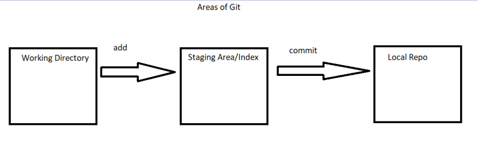

## Git Continuation
* Create a new folder called as cicd (anywhere in your system)
* initialize the repository
* create the following folders and add Readme.md in each folder
    * git
    * maven
    * msbuild
    * sonarqube
    * artifactory
    * jenkins
    * azuredevops

* Now commit these changes
* Now edit Readme.md in git and try to write one line about git (google and write) commit these changes
* Now make the the change in each folder’s Readme.md as one commit


* Now repeat the above by changing readme.md of each tool with one line description and commit it.

## Next Steps:
* Selective addition to staging area.
* Removing the changes from staging area
* Removing the changes from working tree
* Modifying commits.

* Different States a file can be and actions that transition between them


* Areas of git w.r.t local repository



* Current Status:


* Add all the changes into staging area ``` git add --help ```
* Add only modified files to the staging area


* Adding files with some pattern


* Other example


## Moving changes from Staged Area back to working tree

* Add the changes to the staging area


* Now remove one file from staging area (unstage)


* To move the file from modified state in working tree to unmodified


* To move the changes from staging area to unmodified state


* Git reset is the old command and to move the changes from staging area to working tree the following was the approach


* Untracked files add to the staging area


* Moving them back to working tree


* To remove the untracked files from worktree we have ``` git clean ```


* If you have directories as part of your untracked files


## Exercises
* Try to findout what git reset --soft, git reset --hard does?
* Findout what git revert does ?
* Findout what git rm does ?


