## Git In Depth
* Create the following folder structure in a folder called as qtecommerce

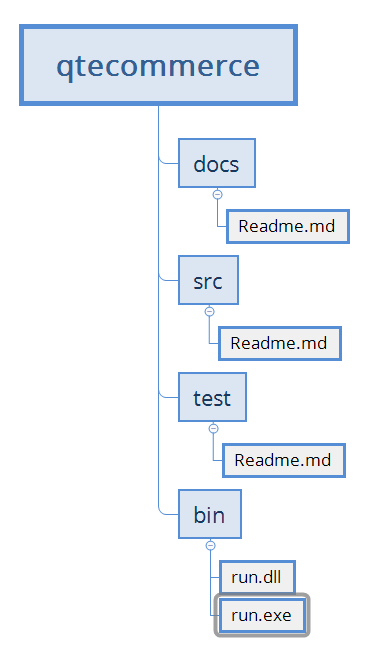

* initialize the git repository
* create a first commit with all the changes apart from bin directory

* Steps: 
    * Create the files and add to the staging area

    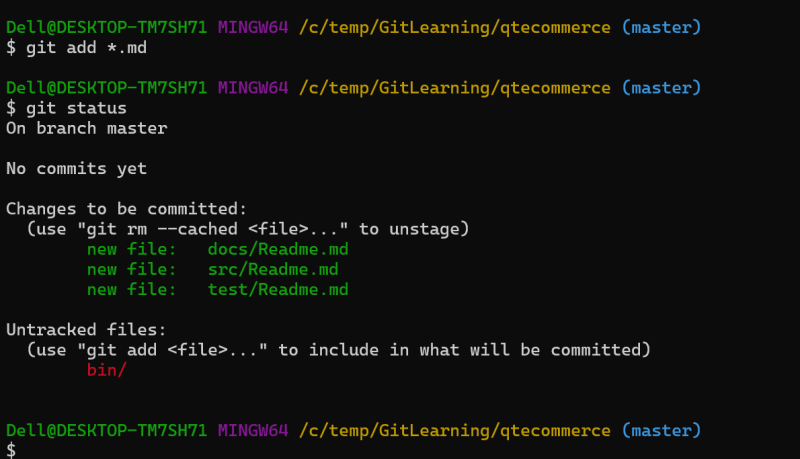

    * commit the changes

    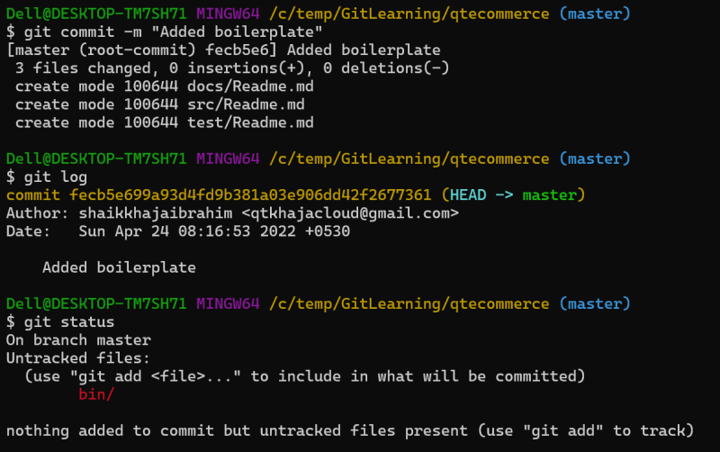

* This repository should never have history of bin folder as it is generated on developers laptop whenever you run application. Every technology has such folders and file formats
    * java => target
    * python => virtual env
    * .net => bin/debug bin/release

* Now we want to perform the following changes

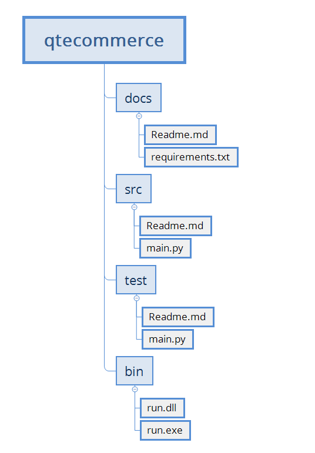

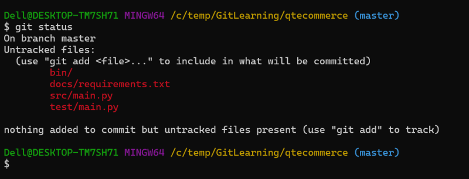

* As i never want bin to part of my version control it would be better if it is ignored in all the git commands like git status
* In git we can create a file in the root folder of working tree ``` qtecommerce ``` called as ``` .gitignore ```.
* In this file mention the folders, file etc.. which you want git to ignore

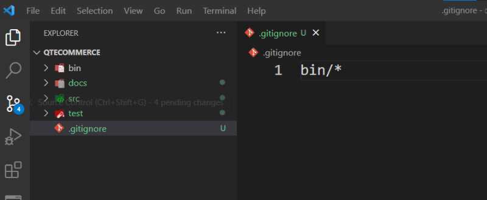

* Add this file to the staging area and execute git status. you should see git ignoring bin directory

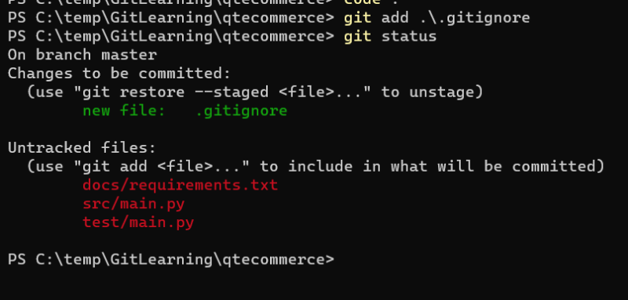

* Now i can add all the changes at one shot

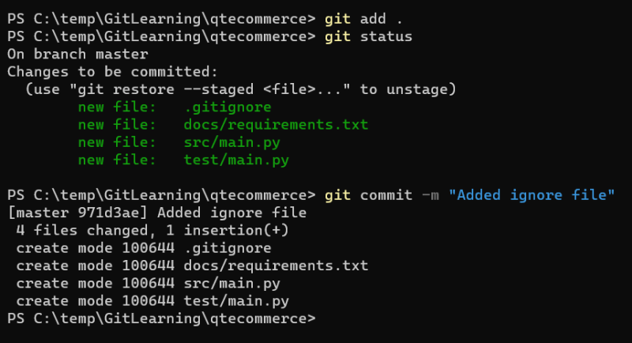

* We can also include some file extensions. Consider the following .pyc which we never want it to be part of version control

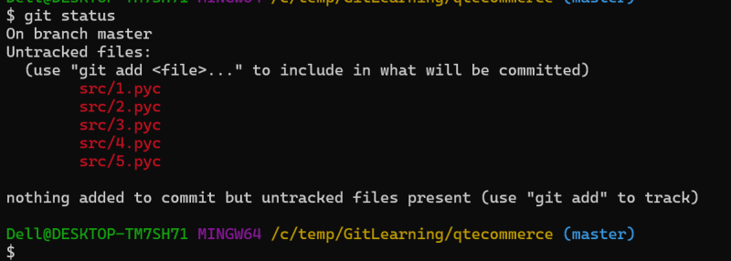

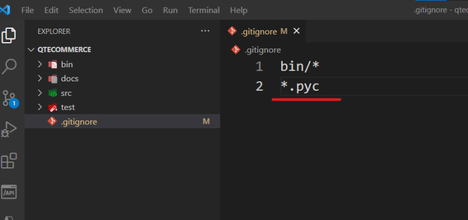

* Add the change to the staging area and see the status

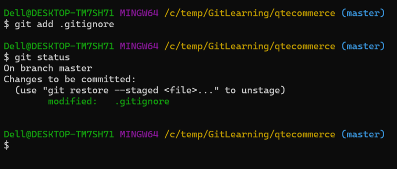

* Now commit the changes

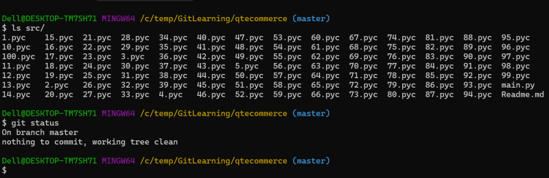

* Now depending on the technology of your application, there are predefined gitignore which can be generate online, but we should be able to modify them as per our custom needs
[Refer Here](https://www.toptal.com/developers/gitignore) for generating .gitignore files
* The history so far looks linear ``` git log --oneline ```
* Now lets assume we have got two customers
    * reliance
    * tatagroup

* We need to add some custom features in the code for reliance and tata
* For common features this linear approach is ok, but also need to have a way to add custom features for reliance and for tata group which includes common
* We need an approach which allows us effectively do the parallel development for the following by using the same working tree
  * different customers
  *  different releases
  *  and so on

* This can be acheived by using branching. Branches in git are very light weight and easy
* Now to bring the changes from one branch into another the following options are available.
   * merging
   * cherry-picking
   * rebase

