### Git Branches
* In Git HEAD is a pointer which refers to what should be shown on the working tree and ideally HEAD should be pointing towards a branch or a tag.
* Now lets create a branch for tata group ``` rel_tata_v1.0 ```

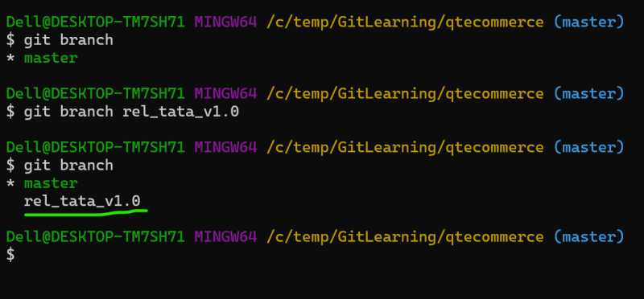

* Now lets move the HEAD (move to rel_tata_v1.0) branch

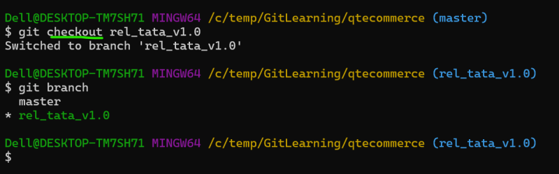

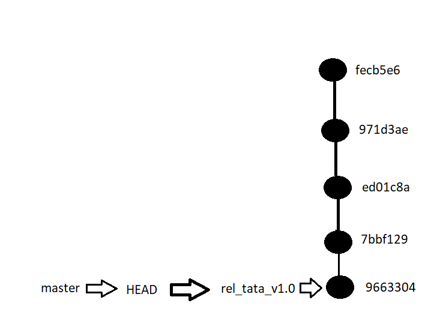

* Now lets add a change in rel_tata_v1.0 branch

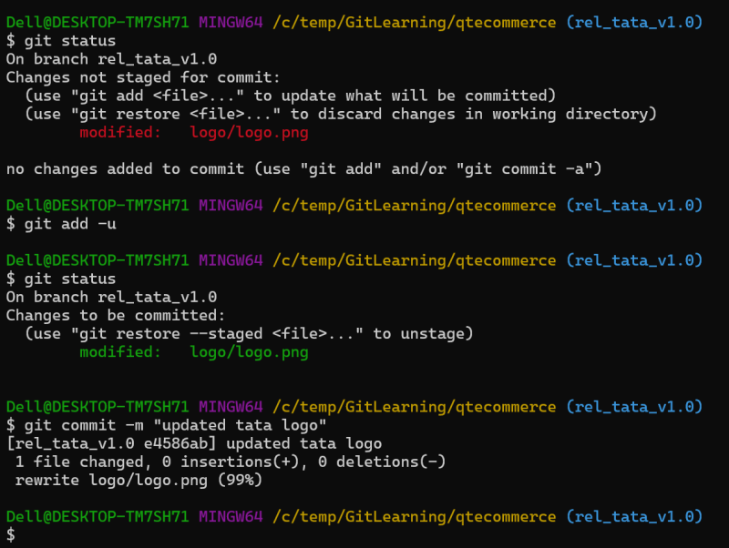

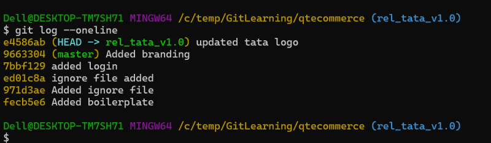

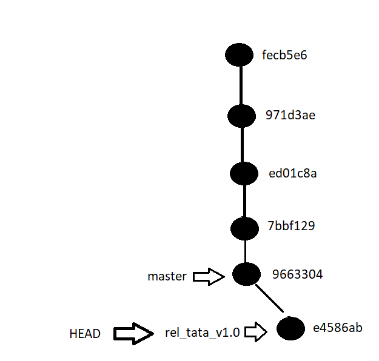

* Now lets move to the master branch

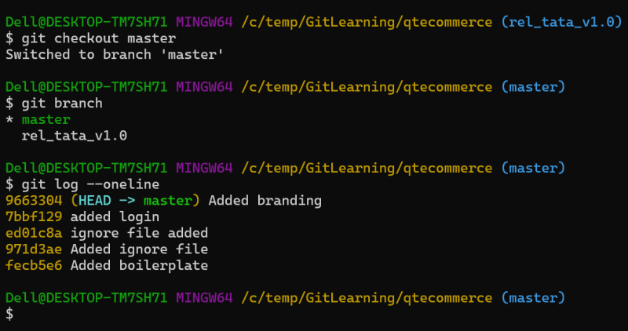

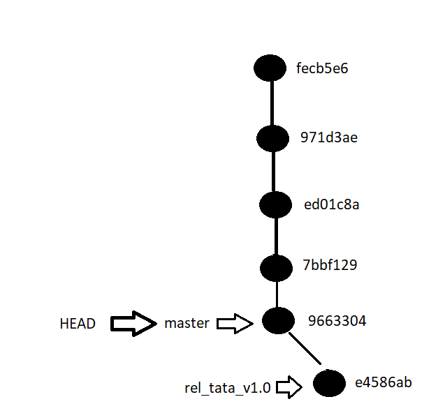

* Now lets create one more branch for wipro group ``` rel_wipro_v1.0 ```

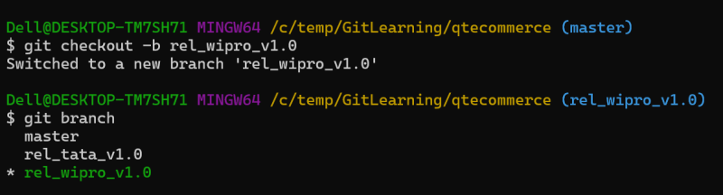

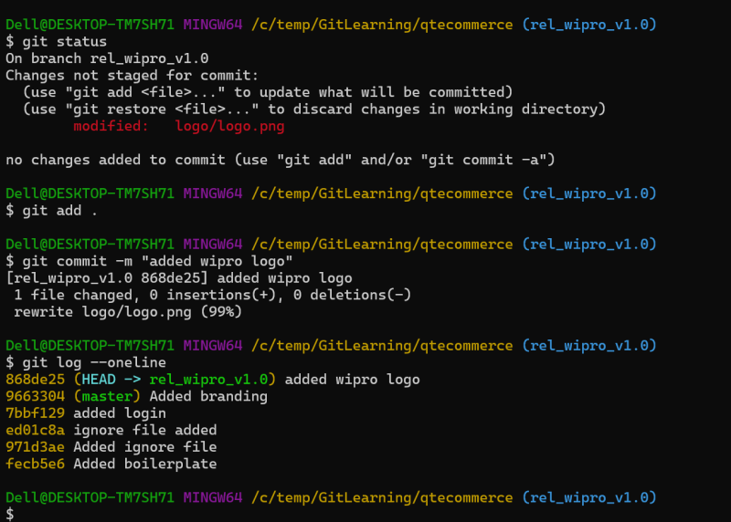

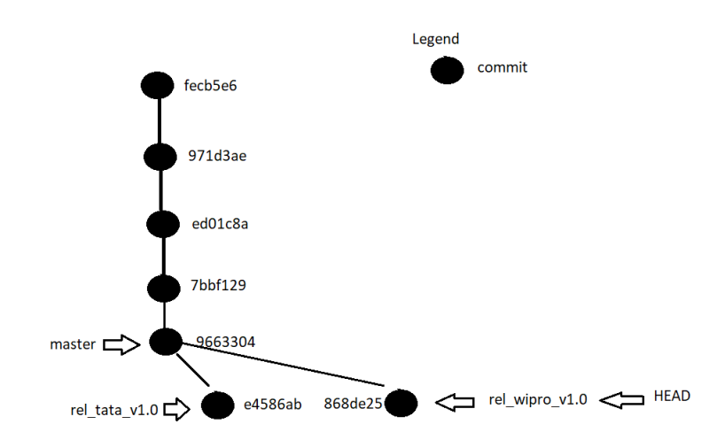

* If the HEAD is pointing towards a commit rather than a branch or a tag this state is referred as __DETACHED_HEAD__.
When you are in a detached head, you are expected only to view the files not make any changes

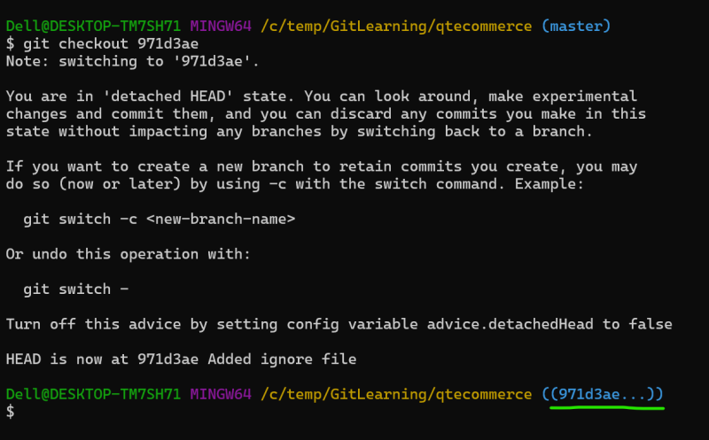

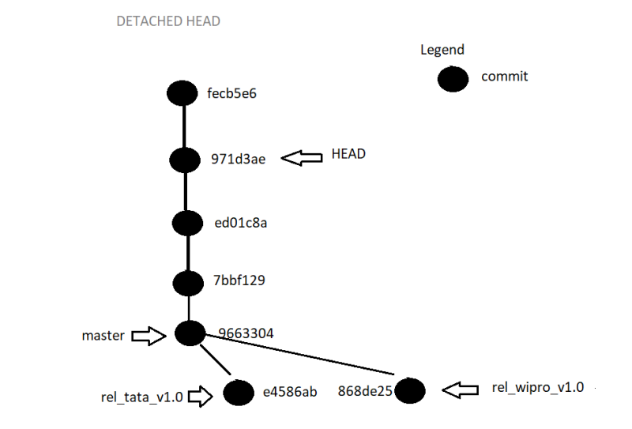

* To recover from detached head state, just use the checkout command and give any branch or tag name

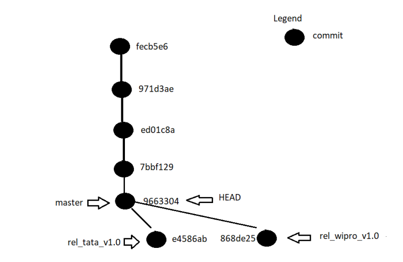